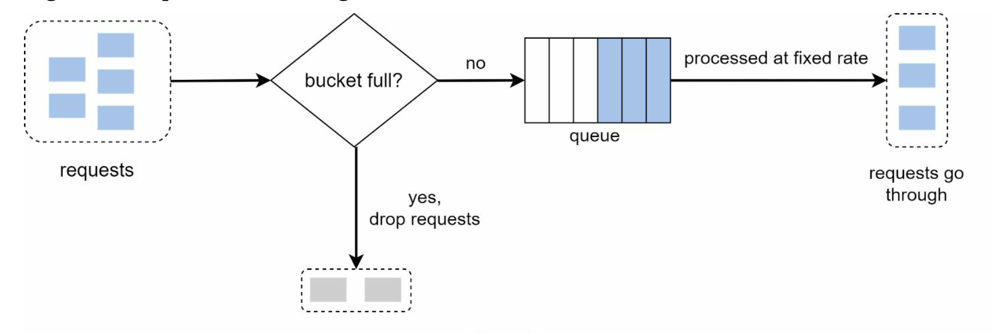

# RATE LIMITER

## Requirements
- Accurately limit excessive requests.
- Low latency. The rate limiter should not slow down HTTP response time.
- Use as little momory as possible.
- Distributed rate limiting. The rate limiter can be shared across multiple servers or processes.
- Exception handling. Show clear exceptions to users when their requests are throttled.
- High fault tolerance. If there are any problems with the rate limiter (for example, a cache server goes offline), it does not effect the entire system.
## Propose high-level design and get buy-in

 
 

  

Cloud microservices have become widely popular and rate limiting is usually implemented within a component called API gateway.

API getway is a fully managed service that supports rate limiting, SSL termination, authentication, IP whitelisting, servicing static content, atc.

## Algorithms for rate limiting
- Token bucket 
- Leaking bucket
- Fixed window counter
- Sliding window log
- Sliding window counter.

### 1. Token bucket algorithm

The token bucket algorithm work as follows:

- A token bucket is a container that has pre-defined capacity. Tokens are put in the bucket at preset rates periodically. Once the bucket is full, no more tokens are added.

 
 

  

- Each request consumes one token. When a request arrices, we check if there are enough token in the bucket.
    - If there are enough tokens, we take one out for each request, and the request goes through.
    - If there are not enough tokens, the request is dropped.

 
 

  

 
 

  

The token bucket algorithm takes two parameters:
- Bucket size: the maximum number of tokens allowed in the bucket.
- Refill rate: number of tokens put into the bucket every second.

How many buckets do we need? This varies, and it depends on the rate-limiting rules. Here are a few examples.
- It is usually necessary to have different buckets for different API endpoints. For instance, if a user is allowed to make 1 post per second, add 150 friends per day, and like 5 posts per second, 3 buckets are required for each user.
- If we need to throttle requests based on IP addresses, each IP address requires a bucket.
- If the system allows a maximum of 10,000 requests per second, it makes sense to have a global bucket shared by all requests.

Pros: 
- The algorithm is easy to implement.
- Memmory afficient.
- Token bucket allows a burst of traffic for short periods. A request can go through as long as there are tokens left.

Cons:
- Two parameters in the algorithm are bucket size and token refill rate. However, it might be challenging to tune them properly.

#### [Example](https://github.com/9bany/token_bucket_rate_limiter)

### 2. Leaking bucket algorithm

The leaking bucket algorithm is similar to the token bucket except that requests are processed at a fixed rate. It is usually implemented with a first-in-first-out (FIFO) queue. The algorithm works as follows:

- When a request arrives, the system checks if the queue is full. If it is not full, the request is added to the queue.
- Otherwise, the request is dropped.
- Requests are pulled from the queue and processed at regular intervals.
 

  

Pros:
- Memory efficient given the limited queue size.
- Requests are processed at a fixed rate therefore it is suitable for use cases that a stable outflow rate is needed.
Cons:
- A burst of traffic fills up the queue with old requests, and if they are not processed in time, recent requests will be rate limited.
- There are two parameters in the algorithm. It might not be easy to tune them properly.

#### [Example](https://github.com/9bany/leaky-bucket)

### 3. Fixed window counter algorithm
Fixed window counter algorithm works as follows:

- The algorithm divides the timeline into fix-sized time windows and assign a counter for each window.

- Each request increments the counter by one.
- Once the counter reaches the pre-defined threshold, new requests are dropped until a new time window starts.

 

  

Pros:
- Memory efficient.
- Easy to understand.
- Resetting available quota at the end of a unit time window fits certain use cases.

Cons:
- Spike in traffic at the edges of a window could cause more requests than the allowed quota to go through.
### 4. Sliding window log algorithm
### 5. Sliding window counter algorithm

## High-level architecture

The basic idea of rate limiting algorithms is simple. At the high-level, we need a counter to keep track of how many requests are sent from the same user, IP address, etc. If the counter is larger than the limit, the request is disallowed.

- INCR: It increases the stored counter by 1.
- EXPIRE: It sets a timeout for the counter. If the timeout expires, the counter is automatically deleted.

 

  

- The client sends a request to rate limiting middleware.
- Rate limiting middleware fetches the counter from the corresponding bucket in Redis and
 
checks if the limit is reached or not.
- If the limit is reached, the request is rejected.
- If the limit is not reached, the request is sent to API servers. Meanwhile, the system increments the counter and saves it back to Redis.

## Design deep dive

### Rate limiting rules

Lyft open-sourced their rate-limiting component

### Exceeding the rate limit

In case a request is rate limited, APIs return a HTTP response code 429 (too many requests) to the client. Depending on the use cases, we may enqueue the rate-limited requests to be processed later. For example, if some orders are rate limited due to system overload, we may keep those orders to be processed later.

### Rate limiter headers
How does a client know whether it is being throttled? And how does a client know the number of allowed remaining requests before being throttled? The answer lies in HTTP response headers. The rate limiter returns the following HTTP headers to clients:
- `X-Ratelimit-Remaining`: The remaining number of allowed requests within the window. 
- `X-Ratelimit-Limit`: It indicates how many calls the client can make per time window.
- `X-Ratelimit-Retry-After`: The number of seconds to wait until you can make a request again without being throttled.
When a user has sent too many requests, a 429 too many requests error and `X-Ratelimit-Retry-After` header are returned to the client.

 

  

### Rate limiter in a distributed environment

1. Race condition

As discussed earlier, rate limiter works as follows at the high-level: • Read the counter value from Redis.
-  Check if ( counter + 1 ) exceeds the threshold.
-  If not, increment the counter value by 1 in Redis.

Race conditions can happen in a highly concurrent environment 
 

  

2. Synchronization issue

Synchronization is another important factor to consider in a distributed environment. To support millions of users, one rate limiter server might not be enough to handle the traffic. When multiple rate limiter servers are used, synchronization is required.

 

  

### Performance optimization

Performance optimization is a common topic in system design interviews. We will cover two areas to improve.

- Multi-data center setup is crucial for a rate limiter because latency is high for users located far away from the data center. Most cloud service providers build many edge server locations around the world

- Synchronize data with an eventual consistency model. If you are unclear about the eventual consistency model, refer to the “Consistency” section.

### Monitoring
After the rate limiter is put in place, it is important to gather analytics data to check whether the rate limiter is effective. Primarily, we want to make sure:

- The rate limiting algorithm is effective. 
- The rate limiting rules are effective.

For example, if rate limiting rules are too strict, many valid requests are dropped. In this case, we want to relax the rules a little bit. In another example, we notice our rate limiter becomes ineffective when there is a sudden increase in traffic like flash sales. In this scenario, we may replace the algorithm to support burst traffic. Token bucket is a good fit here.
