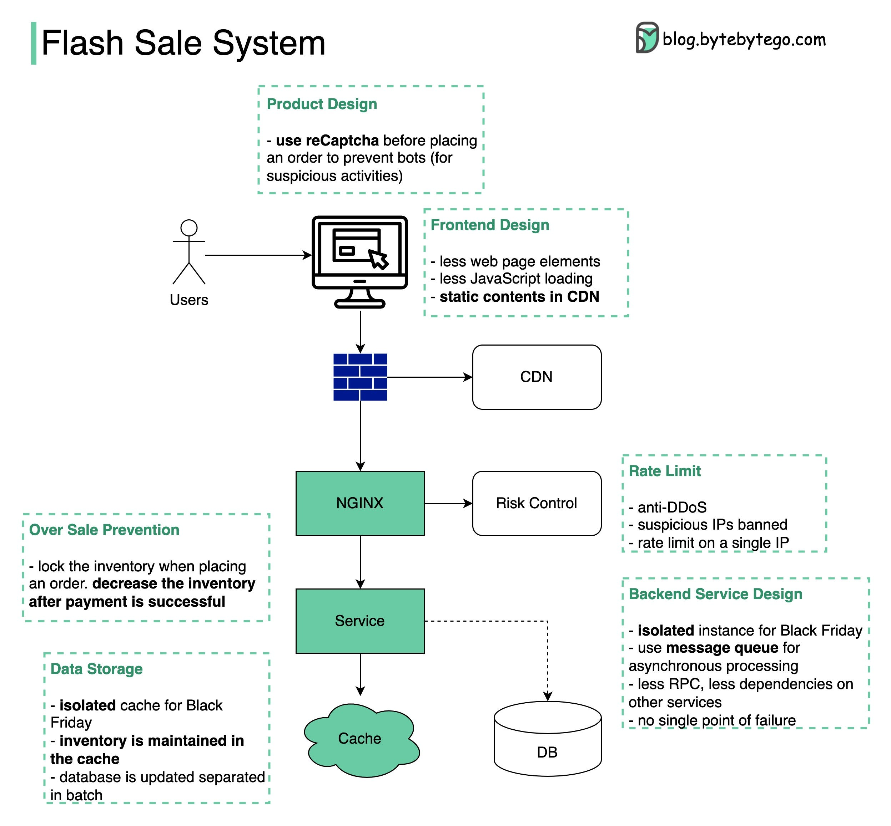

## Flash sale system

 
 

  

###  Design principles:

Less is more. Fewer elements on the web page, fewer data queries to the database, fewer web requests, fewer system dependencies

Short critical path. Fewer hops among services or merge into one service

Async. Use message queues to handle high TPS

Isolation.  Isolate static and dynamic contents, isolate processes and databases for rare items

Overselling is bad. When and how to manage the inventory is important

User experience is important. We don’t want to inform users that they have successfully placed orders but later tell them no items are available