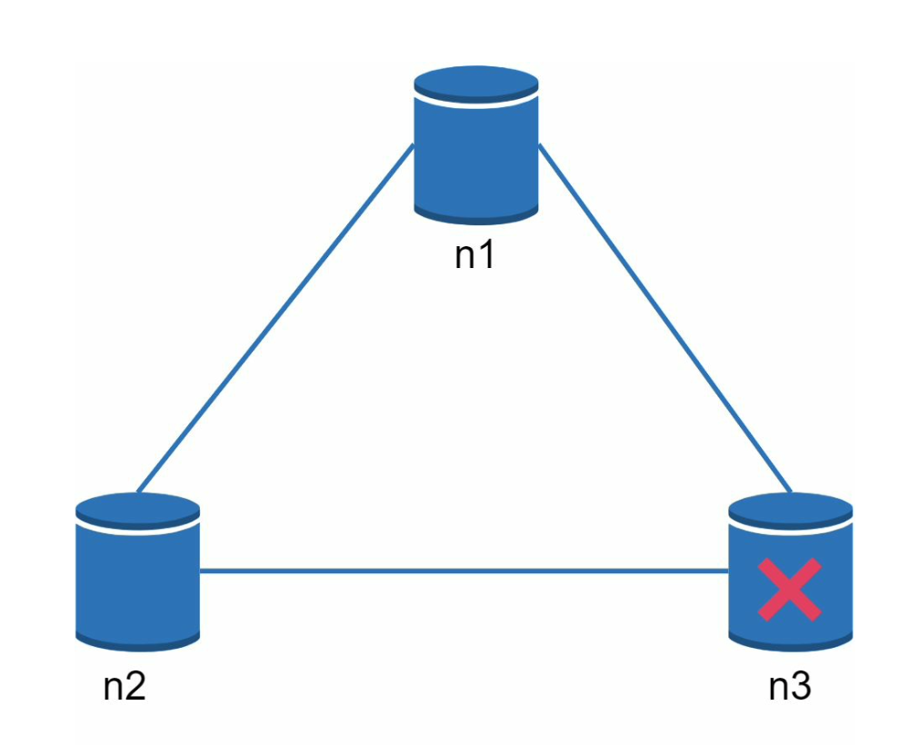
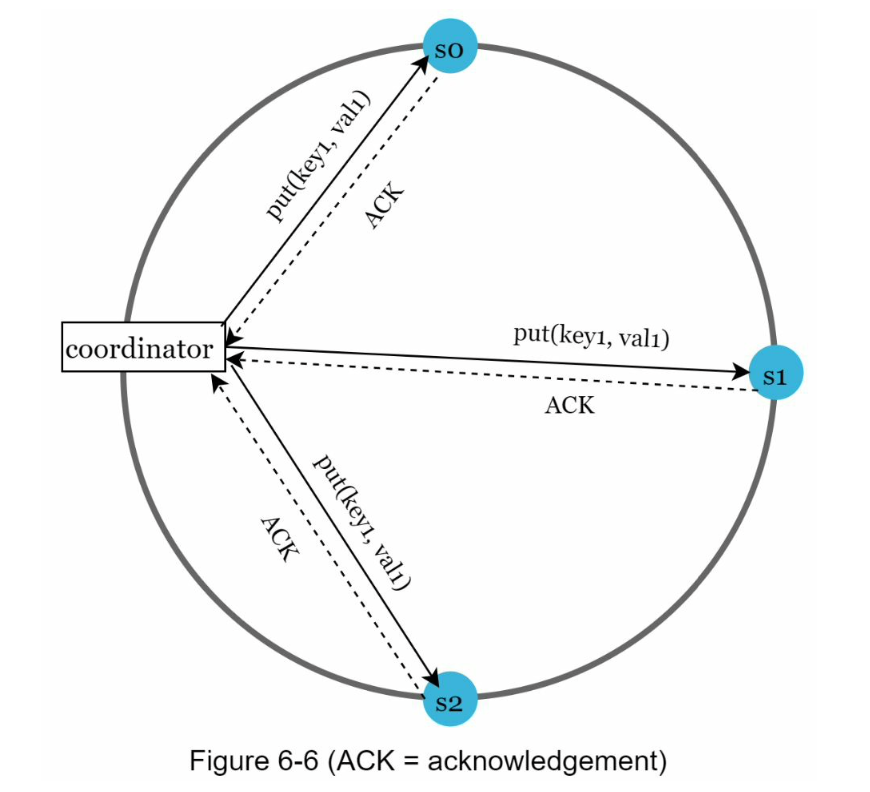
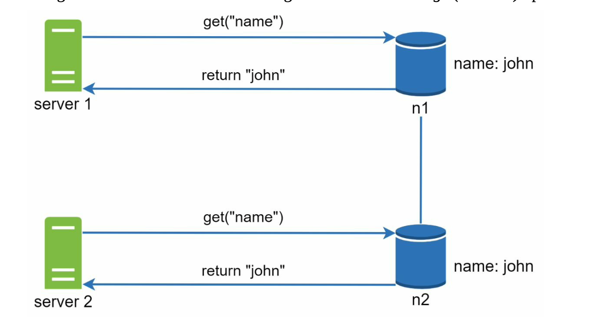
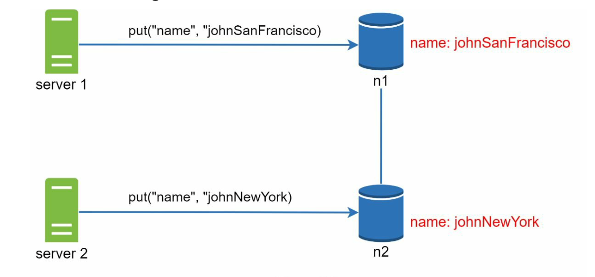

# Key value store

- Key: must be unique, and the value associated with the ket can be accessed through the key. Keys can be plain text or hash values.

- Value: The value in a key-value pair can be strings, lists, objects, etc.

- Ex: Amazon dynamo, Memcached, Redis, etc.

## Contents

- [Understand the problem and astablish design scope](#understand-the-problem-and-astablish-design-scope)
- [Single server key-value store](#single-server-key-value-store)
- [Distribute key-value store](#distribute-key-value-store)
- [CAP theorem](#cap-theorem)
    - [Consistency](#consistency)
    - [Availability](#availability)
    - [Partition Tolerance](#partition-tolerance)
- [System components](#system-components)
    - [Data partition](#data-partition)
    - [Data replication](#data-replication)
    - [Consistency](#consistency-1)
    - [Inconsistency resolution: versioning](#inconsistency-resolution-versioning)
    - [Handling failures](#handling-failures)
    - [System architecture diagram](#system-architecture-diagram)
    - [Write path](#write-path)
    - [Read path](#read-path)
- [Summary](#summary)

## Understand the problem and astablish design scope

- The size of a key-value pair is small: lass than 10KB.
- Ability to store big data.
- High availability: The system responds quikly, even during failures.
- High scalability: The system can be scaled to support large data set.
- Automatic scaling: The addition/deletion of servers should be automatic base on traffic.
- Tunable consistency.
- Low latency.

## Single server key-value store
- Two optimizations can be done to fit more data in a single server: 
    - Data conpression
    - Store only frequently used data in memory and the rest on disk
## Distribute key-value store
- Distribute key-value store is also called a distributed hash table
- When designing a distributed system, it is important to understand CAP(Consistency, Availability, Partition Tolerance) theorem.
## CAP theorem
### Consistency
- Consistency means all clients see the same data at the same time no matter which node they connect to.
### Availability
- Availability means any client which requests data gets a response even if some of the nodes are down.
### Partition Tolerance
- A partition indicates a communication break between two nodes. Partition tolerance means the system continues to operate despit network partition.

Key-value stores are classified based on the two CAP characteristics the support:
- CP (consistency and partition tolerance) systems: [mongoDB](https://www.mongodb.com/)
- AP (availability and partition tolerance) systems: [apache/cassandra](https://github.com/apache/cassandra)
- CA (consistency and availability) systems

> Since network failure is unavoidable, a distributed system must tolerate network partition. Thus, a CA system cannot exist in real-world applications.

### Ideal situation
- In the ideal world, network partition never occurs. Data written to `n1` is automatically replicated to `n2` and `n3`. Both concsistency and availability are achieved.

### Real-world distributed systems
- In a distributed system, partitions cannot be avoided, and when a partition occurs, we must choose between consistency and availability.

Ex: 

- `n3` goes down and cannot communicate with `n1` and `n2`. If clients write data to `n1` or `n2`, data cannot be propagated to `n3`. If data is written to `n3` but not propagated to `n1` and `n2` yet, `n1` and `n2` would have stale data.

 
 

  

If we choose consistency over availability (CP system), we must block all srote operations to `n1` and `n2` to avoid data inconsistency among these three servers, which majes the system unavailable. 

Bank systems usually have extremely high consistent requirements. For example, it is crucial for a bank system to display the most up-to-date bablance info. If inconsistency occurs due to a network partition, the bank system returns error before the inconsistency is resolved.

However, if we choose availability over consistency (AP system), the system keeps accepting reads, even though it might return stale data. For writes, `n1` and `n2` will keep accepting writes, and data will be synced to `n3` when the network partition is resolved.

Choosing the right CAP guarantees the fit your use case is an important step in building a distributed key-value store.

## System components
### Data partition

For large applications, it is infeasible to fit the complete data set in a single server. The simplest way to accomplish this is to split data into smaller partitions and store them in multiple servers. There are two chanllenges while partitioning the data:

- Distribute data across multiple servers evenly.
- Minimize data movement whe nodes are added or removed.

> [Consistent hashing](./design_consistent_hashing.md) is a great technique to solve these problems.

#### Automatic scaling

Servers could be added and removed automatically depending on the load.
#### Heterogeneity

The number of virtual nodes of a server is proportional to the server capacity.

Ex: servers with higher capacity are assigned with more with more virtual nodes.

### Data replication

To achieve high availability and reliability, data must be replicated asynchronously over N servers, where N is a configurable parameter. These N servers are chosen using the following logic: after a key is mapped to a position on the hash ring, walk clockwise from that position and chose the first N servers on the ring to store data copies.

With virtual nodes, the first N nodes on the ring may be owned by fewer than N physical servers. To avoid this issue, we only choose unique servers while performing the clockwise walk logic.

Nodes in the same data center often fail at the same time due to power outages, network issues, natural disasters. For better repiability, replicas are placed in distinct data centers, and data centers are connected through high-speed networks.

### Consistency

Since date replicated at multiple nodes, it must be synchronized across replicas. Qourum consensus can guarantee consistency for both read and write operations. Let us astablish a few definitions first.

- N: The number of replicas
- W: A write qourum of size W. For a write operation to be considered as successful, write operation must be acknowledged from W replicas.

 
 

  

### Inconsistency resolution: versioning

#### Problems
Replication gives high availability but causes inconsistencies among replicas. Versioning and vactor looks are used to solve inconsistency problems. Versioning meaning treating each data modification as a new immutable version of data.

 

  

 

  

In this example, the original value could be ignored because the modifications ware based on it. However there is no clear way to resolve the conflict of the last two versions. To resolve this issue, we need to versioning system that can detect conflicts and reconcile conflict. A vector clock is a common technique to solve this problem.

### Handling failures
### System architecture diagram
### Write path
### Read path
## Summary
