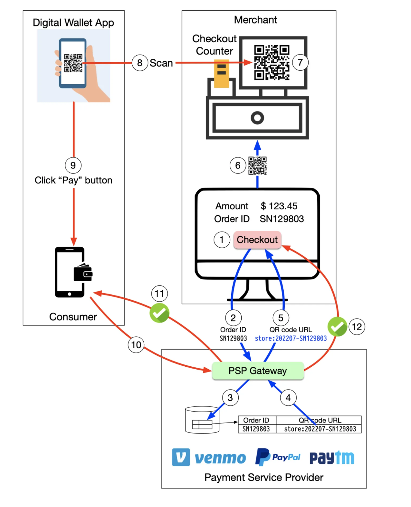

## How do you pay from your digital wallets, such as Paytm, Paypal, and Venmo, by scanning the QR code?

To understand the process involved, we need to divide the “scan to pay” process into two sub-processes:
1. Merchant generates a QR code and displays it on the screen
2. Consumer scans the QR code and pays

 
 

  

Here are the steps for generating the QR code:

1. When you want to pay for your shopping, the cashier tallies up all the goods and calculates the total amount due, for example, $123.45. The checkout has an order ID of SN129803. The cashier clicks the “checkout” button.

1. The cashier’s computer sends the order ID and the amount to PSP.

1. The PSP saves this information to the database and generates a QR code URL.

1. PSP’s Payment Gateway service reads the QR code URL.

1. The payment gateway returns the QR code URL to the merchant’s computer.

1. The merchant’s computer sends the QR code URL (or image) to the checkout counter.

1. The checkout counter displays the QR code.

These 7 steps are completed in less than a second. Now it’s the consumer’s turn to pay from their digital wallet by scanning the QR code:

1. The consumer opens their digital wallet app to scan the QR code.

1. After confirming the amount is correct, the client clicks the “pay” button.

1. The digital wallet App notifies the PSP that the consumer has paid the given QR code.

1. The PSP payment gateway marks this QR code as paid and returns a success message to the consumer’s digital wallet App.

1. The PSP payment gateway notifies the merchant that the consumer has paid the given QR code. 

> Over to you: I have detailed how to pay using a dynamic QR code. It is dynamic because the QR code is dynamically generated each time. But sometimes, you could pay by scanning a printed QR code in a merchant’s shop, which is called the static QR code. Do you know how a static QR code works?