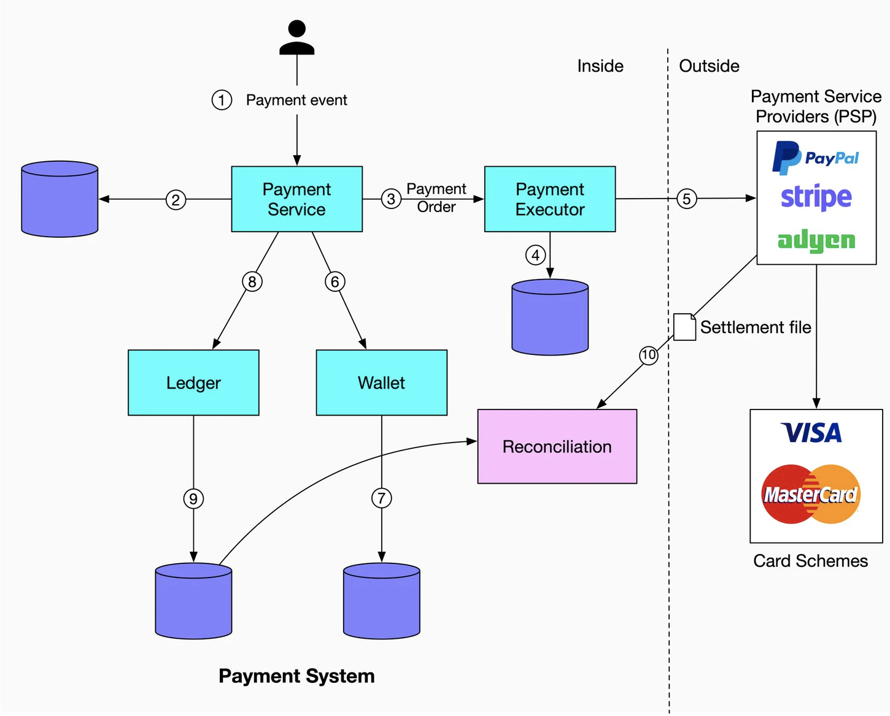

# Payment system

> source: https://blog.bytebytego.com/p/payment-system

 
 

  

1. When a user clicks the “Buy” button, a payment event is generated and sent to the payment service.

2. The payment service stores the payment event in the database.

3. Sometimes a single payment event may contain several payment orders. For example, you may select products from multiple sellers in a single checkout process. The payment service will call the payment executor for each payment order.

4. The payment executor stores the payment order in the database.

5. The payment executor calls an external PSP to finish the credit card payment.

6. After the payment executor has successfully executed the payment, the payment service will update the wallet to record how much money a given seller has.

7. The wallet server stores the updated balance information in the database.

8. After the wallet service has successfully updated the seller’s balance information, the payment service will call the ledger to update it.

9. The ledger service appends the new ledger information to the database.

10. Every night the PSP or banks send settlement files to their clients. The settlement file contains the balance of the bank account, together with all the transactions that took place on this bank account during the day. 