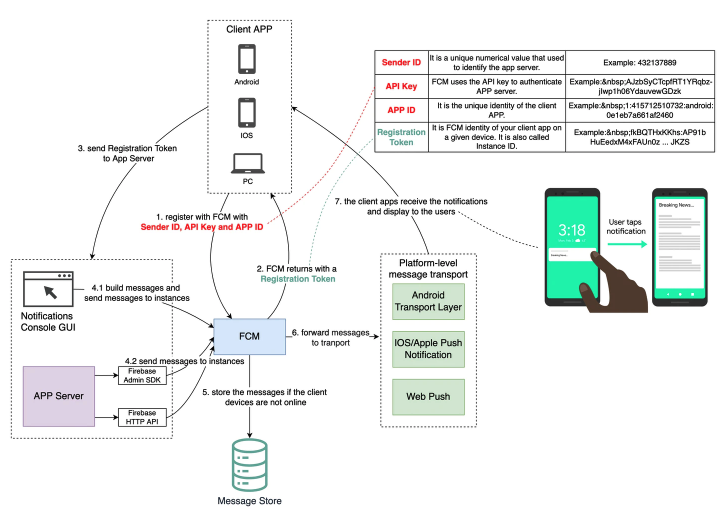

# Push notification with firebase

 
 

  

FCM is a cross-platform messaging solution that can compose, send, queue, and route notifications reliably. It provides a unified API between message senders (app servers) and receivers (client apps). The app developer can use this solution to drive user retention. 
 
- Steps 1 - 2: When the client app starts for the first time, the client app sends credentials to FCM, including Sender ID, API Key, and App ID. FCM generates Registration Token for the client app instance (so the Registration Token is also called Instance ID). This token must be included in the notifications.
 
- Step 3: The client app sends the Registration Token to the app server. The app server caches the token for subsequent communications. Over time, the app server has too many tokens to maintain, so the recommended practice is to store the token with timestamps and to remove stale tokens from time to time. 
 
- Step 4: There are two ways to send messages. One is to compose messages directly in the console GUI (Step 4.1,) and the other is to send the messages from the app server (Step 4.2.) We can use the Firebase Admin SDK or HTTP for the latter.
 
- Step 5: FCM receives the messages, and queues the messages in the storage if the devices are not online. 
 
- Step 6: FCM forwards the messages to platform-level transport. This transport layer handles platform-specific configurations.
 
- Step 7: The messages are routed to the targeted devices. The notifications can be displayed according to the configurations sent from the app server [1].
 
> Over to you: We can also send messages to a “topic” (just like Kafka) in Step 4. When should the client app subscribe to the topic?
 
Reference Material: Google firebase documentation