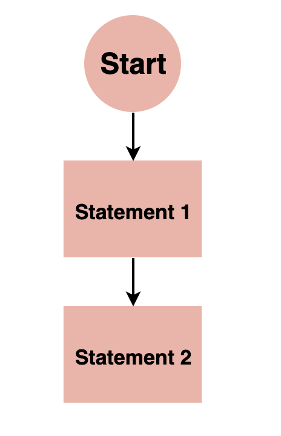
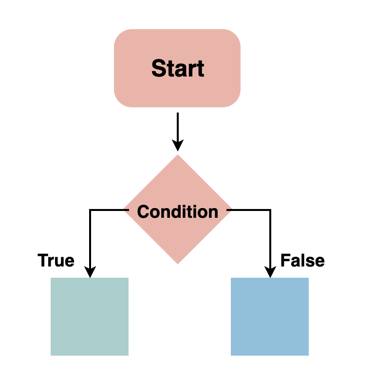
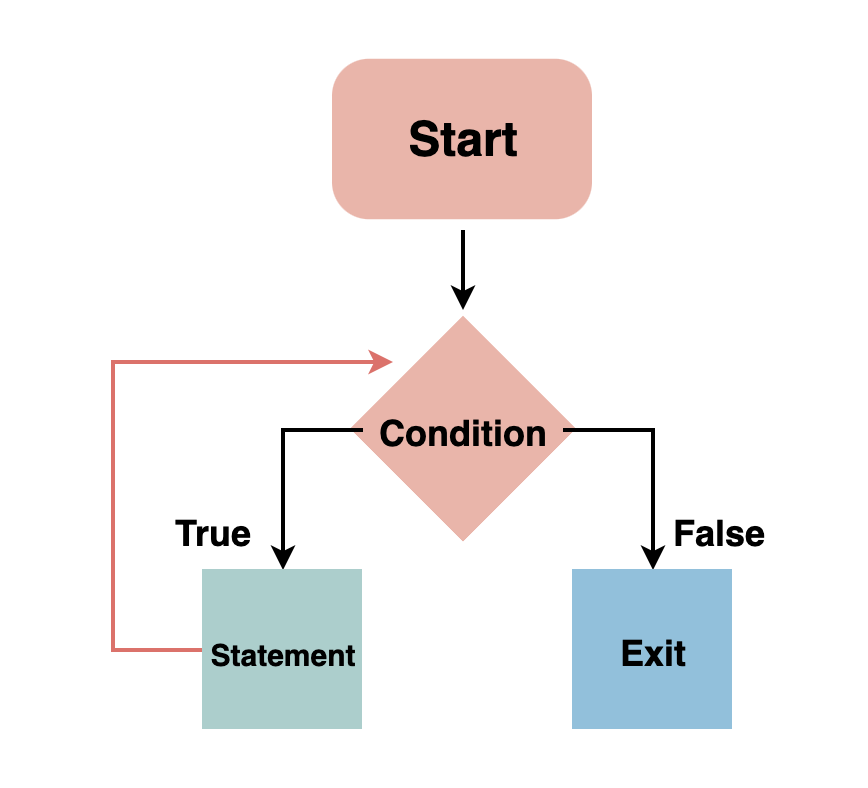

# Golang 

## Contents
- [Programing fundamentals](#programing-fundamentals)
    - [Variable declaration](#variable-declaration)
    - [Basic syntax](#basic-syntax)
    - [Data types and structures](#data-types-and-structures)
    - [Flow control structures](#flow-control-structures)
    - [Sequential](#sequential)
    - [Selection (conditionals)](#selection-conditionals)
    - [Iteration (Loops)](#iteration-loops)
    - [Functional programming](#functional-programming)
    - [Object-oriented programming](#object-oriented-programming)
    - [Debuging ](#debuging)
    - [IDEs and Coding Environments](#ides-and-coding-environments)
    - [Bit shifing](#bit-shifing)
    - [iota](#iota)
- [Variables, Values & Type](#variables-values--type)
    - [Variables](#variables)
    - [Values](#values)
    - [Type](#type)
- [Control flow](#control-flow)
    - [If/else](#ifelse)
    - [Switch](#switch)
- [Grouping data](#grouping-data)
    - [Array](#array)
    - [Slice](#slice)
    - [Map](#map)
- [Structs](#structs)
    - [Embedded structs](#embedded-structs)
    - [Anonymous struct](#anonymous-struct)
- [Functions](#functions)
    - [Multiple return values](#multiple-return-values)
    - [Varidic Functions](#variadic-functions)
    - [Unfurling a slice](#unfurling-a-slice)
    - [Closure](#closures)
    - [Recursion](#recursion)
    - [Defer](#defer)
    - [Interface & polymorphism](#interface--polymorphism)
    - [Func expression](#func-expression)
    - [Callback](#callback)
    - [Generic]
- [Pointers ](#pointers)
- [Application](#application-json-sort)
    - [JSON - marshal/unmarshal](#json---marshalunmarshal)
    - [Sorting](#sorting)
    - [Sorting by function](#sorting-by-function)
    - [Interface](#interface)
    - [Bcrypt](#bcrypt)
- [Concurrency](#concurrency)
- [Channels](#channels)
- [Error handling](#error-handling)
- [Writing ducomentation](#writing-ducomentation)
- [Testing and benchmarking](#testing-and-benchmarking)
    - [Benchmarking](#benchmark)
    - [Table tests](#table-tests)
    - [golint](#golint)
    - [Coverage](#coverage)
## Programing fundamentals
### Variable declaration
<a href="#contents">Back to top</a>

`Variables` are containers for storing data values, a memory location for a data type. Variables are created using a declaration or keyword that varies across languages.

Variable names are usually alphanumeric, that is, they contain a-z and 0-9. They can also include special characters like underscore or the dollar sign.

Variables can hold values of any data type supported by the programming language. This value may change during program execution.
### Basic syntax
<a href="#contents">Back to top</a>

```go 
package main

import "fmt"

func main() {
    fmt.Println("Hello world")
}
```
### Data types and structures.
<a href="#contents">Back to top</a>

- Types: 
    -String
    - Boolean (true or false)
    - Numbers, which includes integers (whole numbers from 1) and floating-point numbers (decimal-base)
    - Characters (includes single alphabets or numbers)
    - Arrays (a collection of data, usually of the same data type)

- Structures:
    - Stacks
    - Heaps
    - Trees
    - Linked lists
    - Queues
    - Arrays
    - Tables
    - Graphs
### Flow control structures
<a href="#contents">Back to top</a>

They are commands that allow a program to “decide” to take one direction or another.

There are three basic types of control structures: sequential, selection, and iteration.
### Sequential
<a href="#contents">Back to top</a>
It involves the execution of code statements one after the other. A real-world example is following a cooking recipe.
<p align="center">
  
</p>

### Selection (conditionals)
<a href="#contents">Back to top</a>

The computer decides what action to perform based on the result of a test or condition equalling true or false.
<p align="center">
  
</p>

### Iteration (Loops).
<a href="#contents">Back to top</a>

A loop is a programming structure that allows a statement or block of code to be run repeatedly until a specified condition is no longer true (will return Boolean, true or false). It is one of the most powerful and fundamental programming concepts.

<p align="center">
  
</p>

### Functional programming
<a href="#contents">Back to top</a>

Functions are containers that take in a set of inputs and return an output. It is not required for a function to return a value. Pure functions will always give the same result for the same set of inputs.

Functional Programming is a straightforward method of building software that involves using pure functions. This method eliminates the occurrence of data mutation or side effects.
### Object-oriented programming
<a href="#contents">Back to top</a>

***Object-Oriented Programming (OOP)*** is a programming concept that revolves around ‘objects’ and `methods`.

There are four principles of OOP:

- Inheritance
- Polymorphism
- Abstraction
- Encapsulation
### Debuging 
<a href="#contents">Back to top</a>
Debugging is a crucial skill. It involves detecting and removing existing and potential errors, defects, or ‘loopholes’ in one’s code.
### IDEs and Coding Environments
<a href="#contents">Back to top</a>

IDE stands for Integrated Development Environment

Some common examples of IDE’s are:

- Visual Studio code
- ...

### Bit shifing
<a href="#contents">Back to top</a>

#### The Operators
<a href="#contents">Back to top</a>
- `>>` is the arithmetic (or signed) right shift operator.
- `>>>` is the logical (or unsigned) right shift operator.
- `<<` is the left shift operator, and meets the needs of both logical and arithmetic shifts.

All of these operators can be applied to integer values (int, long, possibly short and byte or char). In some languages, applying the shift operators to any datatype smaller than int automatically resizes the operand to be an int.

Note that `<<<` is not an operator, because it would be redundant.

Also note that C and C++ do not distinguish between the right shift operators. They provide only the >> operator, and the right-shifting behavior is implementation defined for signed types. The rest of the answer uses the C# / Java operators.

#### Left shift (<<)
<a href="#contents">Back to top</a>

Integers are stored, in memory, as a series of bits. For example, the number `6` stored as a 32-bit `int` would be:

```
00000000 00000000 00000000 00000110
```

Shifting this bit pattern to the left one position (`6 << 1`) would result in the number 12:
```
00000000 00000000 00000000 00001100
```

As you can see, the digits have shifted to the left by one position, and the last digit on the right is filled with a zero. You might also note that shifting left is equivalent to multiplication by powers of 2. So `6 << 1` is equivalent to `6 * 2`, and `6 << 3` is equivalent to `6 * 8`. A good optimizing compiler will replace multiplications with shifts when possible.

#### Non-circular shifting
<a href="#contents">Back to top</a>

Please note that these are not circular shifts. Shifting this value to the left by one position (`3,758,096,384 << 1`):

```
11100000 00000000 00000000 00000000
```

results in 3,221,225,472:
```
11000000 00000000 00000000 00000000
```
The digit that gets shifted "off the end" is lost. It does not wrap around.

#### Logical right shift (>>>)
<a href="#contents">Back to top</a>
A logical right shift is the converse to the left shift. Rather than moving bits to the left, they simply move to the right. For example, shifting the number 12:
```
00000000 00000000 00000000 00001100
```

to the right by one position (12 >>> 1) will get back our original 6:
```
00000000 00000000 00000000 00000110
```
So we see that shifting to the right is equivalent to division by powers of 2.

#### Lost bits are gone
<a href="#contents">Back to top</a>
However, a shift cannot reclaim "lost" bits. For example, if we shift this pattern:
```
00111000 00000000 00000000 00000110
```
to the left 4 positions (`939,524,102 << 4`), we get `2,147,483,744`:
```
10000000 00000000 00000000 01100000
```
and then shifting back (`(939,524,102 << 4) >>> 4`) we get `134,217,734`:
```
00001000 00000000 00000000 00000110
```
We cannot get back our original value once we have lost bits.


#### Arithmetic right shift (>>)
<a href="#contents">Back to top</a>

The arithmetic right shift is exactly like the logical right shift, except instead of padding with zero, it pads with the most significant bit. This is because the most significant bit is the sign bit, or the bit that distinguishes positive and negative numbers. By padding with the most significant bit, the arithmetic right shift is sign-preserving.

For example, if we interpret this bit pattern as a negative number:
```
10000000 00000000 00000000 01100000
```
we have the number `-2,147,483,552`. Shifting this to the right 4 positions with the arithmetic shift (`-2,147,483,552 >> 4`) would give us:
```
11111000 00000000 00000000 00000110
```
or the number `-134,217,722.`

So we see that we have preserved the sign of our negative numbers by using the arithmetic right shift, rather than the logical right shift. And once again, we see that we are performing division by powers of 2.

### iota
<a href="#contents">Back to top</a>

- The iota keyword represents successive integer constants 0, 1, 2,…
- It resets to 0 whenever the word const appears in the source code,
- and increments after each const specification.

#### Basic exmaple
<a href="#contents">Back to top</a>
```go
package main 

const (
    a = iota 
    b
    c
)
```

#### Start from one
<a href="#contents">Back to top</a>

```go
package main 

const (
    a = iota + 1
    b
    c
)
```

#### Skip value
<a href="#contents">Back to top</a>
```go
package main 

const (
    a = iota 
    _
    b
    c
)
```
#### Complete enum type with strings [best practice]
<a href="#contents">Back to top</a>
Here’s an idiomatic way to implement an enumerated type:

- Create a new integer type,
- List its values using iota,
- Give the type a String function.

```go
type Direction int

const (
    North Direction = iota
    East
    South
    West
)

func (d Direction) String() string {
    return [...]string{"North", "East", "South", "West"}[d]
}
```
Use 
```go
var d Direction = North
fmt.Print(d)
switch d {
case North:
    fmt.Println(" goes up.")
    fmt.Println(d.String())
case South:
    fmt.Println(" goes down.")
    fmt.Println(d.String())
default:
    fmt.Println(" stays put.")
    fmt.Println(d.String())
}
// Output: North goes up.
```
## Variables, Values & Type
### Variables
<a href="#contents">Back to top</a>
var declares 1 or more variables.
```go
    var a = "initial"
    fmt.Println(a)
```
You can declare multiple variables at once.
```go
    var b, c int = 1, 2
    fmt.Println(b, c)
```
Go will infer the type of initialized variables.
```go
    var d = true
    fmt.Println(d)
```
Variables declared without a corresponding initialization are zero-valued. For example, the zero value for an int is 0.
```go
    var e int
    fmt.Println(e)
```
The := syntax is shorthand for declaring and initializing a variable, e.g. for var f string = "apple" in this case.
```go
    f := "apple"
    fmt.Println(f)
```

## Values 
	
Strings, which can be added together with +.
```go
    fmt.Println("go" + "lang")
```
Integers and floats.
```go
    fmt.Println("1+1 =", 1+1)
    fmt.Println("7.0/3.0 =", 7.0/3.0)
```
Booleans, with boolean operators as you’d expect.
```go
    fmt.Println(true && false)
    fmt.Println(true || false)
    fmt.Println(!true)
```
### Type
<a href="#contents">Back to top</a>

| type   |      byte      |  range |
|----------|:-------------:|------:|
| `bool` |   |  |
| `string` |      |    |
| `int8` | 8-bit |    -128 to 127 |
| `int16` | 16-bit |    -32768 to 32767 |
| `int` & `int32` | 32-bit |    -2147483648 to 2147483647 |
| `int64` | 64-bit |    -9223372036854775808 to 9223372036854775807 |
| `byte` & `uint8` | 8-bit |    0 to 255 |
| `uint16` | 16-bit |    0 to 65535 |
| `uint32` | 32-bit |    0 to 4294967295 |
| `uint64` | 64-bit |    0 to 18446744073709551615 |
|  `float32`  | 32-bit |1.401298464324817070923729583289916131280e-45 to 3.40282346638528859811704183484516925440e+38. | 
|  `float64`  | 64-bit |  4.940656458412465441765687928682213723651e-324 to 1.797693134862315708145274237317043567981e+308.  |
| `complex64` | 32-bit | like float32 |
| `complex128` | 64-bit | like float64|
| `rune` | 
| `uintptr` | 

#### 1. int and uint
<a href="#contents">Back to top</a>

- Not only can int handle negative values, unlike `uint`, but did you know that byte is actually an alias for the `uint8` type? That’s right, define a byte and check out the type and you will find the type is `uint8` under the hood.

- This brings up a good point: uint’s are used for memory as memory is always a non-negative number (how many `bits/bytes`). So, when you index a string, you will actually get back a byte or `uint8` value. Try it out! You have to explicitly range or convert the string first in order to get a `rune` when indexing (`rune` itself is an alias for `int32`).

- You OFTEN work with bytes in order to transmit data, read/write files, etc. So, it’s definitely worth knowing that a byte is really a `uint8`. The `uint8` is also the smallest unit of the `UTF-8` encoding scheme, which is used for all Go code files. The uint types (`uint8`, `uint16`, `uint32`, & `uint64`) are actually the best types to use for counting and anything else that can never be negative. They produce an overflow error if you try to assign a negative value to them, just like when trying to assign a value over `255` to a `byte/uint8` or any other numeric value above the max for that type.

#### 2. float32 and float64
<a href="#contents">Back to top</a>

- Using math.Float32bits and math.Float64bits, you can see how Go represents the different decimal values as a IEEE 754 binary value:

#### 3. Complex
<a href="#contents">Back to top</a>
- The default type for a complex number in golang is complex128. You can create a complex number like this 
```go
var x = 5 + 7i  // Type inferred as `complex128`

```

Go also provides a built-in function named complex for creating complex numbers. If you’re creating a complex number with variables instead of literals, then you’ll need to use the complex function
```go
var a = 3.57
var b = 6.23

// var c = a + bi won't work. Create the complex number like this -
var c = complex(a, b)
```

Note that, both real and imaginary parts of the complex number must be of the same floating point type. If you try to create a complex number with different real and imaginary part types, then the compiler will throw an error 

```go
var a float32 = 4.92
var b float64 = 7.38

/*
   The Following statement Won't compile. 
   (Both real and imaginary parts must be of the same floating-point type)
*/
var c = complex(a, b)  // Compiler Error
```

#### 4. operations on complex numbers
<a href="#contents">Back to top</a>
You can perform arithmetic operations like addition, subtraction, multiplication, and division on complex numbers
```go
package main
import "fmt"

func main() {
	var a = 3 + 5i
	var b = 2 + 4i

	var res1 = a + b
	var res2 = a - b
	var res3 = a * b
	var res4 = a / b

	fmt.Println(res1, res2, res3, res4)
}
```

```
# Output
(5+9i) (1+1i) (-14+22i) (1.3-0.1i)
```
#### 5. uintptr
<a href="#contents">Back to top</a>

`uintptr` is there to bypass the type system and allow the Go implementors to write Go runtime libraries, including the garbage collection system, in Go, and to call C-callable code including system calls using C pointers that are not handled by Go at all.

If you're acting as an implementor—e.g., providing access to system calls on a new OS—you'll need uintptr. You will also need to know all the special magic required to use it, such as locking your goroutine to an OS-level thread if the OS is going to do stack-ish things to OS-level threads, for instance. (If you're using it with Go pointers, you may also need to tell the compiler not to move your goroutine stack, which is done with special compile-time directives.)

The runtime system considers an unsafe.Pointer as a reference to an object, which keeps the object alive for GC. It does not consider a uintptr as such a reference. (That is, while unsafe.Pointer has a pointer type, uintptr has integer type.) [See also the documentation for the unsafe package](https://pkg.go.dev/unsafe).

#### 6. rune
<a href="#contents">Back to top</a>

A character is defined using “code points” in Unicode. Go language introduced a new term for this code point called rune.

Go rune is also an alias of type int32 because Go uses UTF-8 encoding. Some interesting points about rune and strings.

Strings are made of bytes and they can contain valid characters that can be represented using runes.
We can use the rune() function to convert string to an array of runes.
For ASCII characters, the rune value will be the same as the byte value.


Finding rune of a character in Go

```go
package main
 
import (
    "fmt"
)
 
func main() {
    s := 'a'
 
    s_rune := rune(s)
     
    fmt.Println(s_rune)
}
```
```
97
```

GoLang String to rune
```go
package main
 
import (
    "fmt"
)
 
func main() {
    s := "GoLang"
 
    s_rune := []rune(s)
    fmt.Println(s_rune) // [71 111 76 97 110 103]
 
}
```

Understanding difference between byte and rune
```go
package main
 
import (
    "fmt"
)
 
func main() {
    s := "GÖ"
 
    s_rune := []rune(s)
    s_byte := []byte(s)
     
    fmt.Println(s_rune)  // [71 214]
    fmt.Println(s_byte)  // [71 195 150]
}
```
-> The special Unicode character Ö rune value is 214 but it’s taking two bytes for encoding.


## Control flow
### If/else
<a href="#contents">Back to top</a>

Here’s a basic example.
```go
if 7%2 == 0 {
    fmt.Println("7 is even")
} else {
    fmt.Println("7 is odd")
}
```
You can have an if statement without an else.
```go
if 8%4 == 0 {
    fmt.Println("8 is divisible by 4")
}
```
A statement can precede conditionals; any variables declared in this statement are available in all branches.
```go
if num := 9; num < 0 {
    fmt.Println(num, "is negative")
} else if num < 10 {
    fmt.Println(num, "has 1 digit")
} else {
    fmt.Println(num, "has multiple digits")
}
```
### Switch
<a href="#contents">Back to top</a>

Here’s a basic switch.

```go
i := 2
fmt.Print("Write ", i, " as ")
switch i {
case 1:
    fmt.Println("one")
case 2:
    fmt.Println("two")
case 3:
    fmt.Println("three")
}
```

You can use commas to separate multiple expressions in the same case statement. We use the optional default case in this example as well.
```go
    switch time.Now().Weekday() {
    case time.Saturday, time.Sunday:
        fmt.Println("It's the weekend")
    default:
        fmt.Println("It's a weekday")
    }
```

Switch without an expression is an alternate way to express if/else logic. Here we also show how the case expressions can be non-constants.

```go
    t := time.Now()
    switch {
    case t.Hour() < 12:
        fmt.Println("It's before noon")
    default:
        fmt.Println("It's after noon")
    }
```
A type switch compares types instead of values. You can use this to discover the type of an interface value. In this example, the variable t will have the type corresponding to its clause.
```go
    whatAmI := func(i interface{}) {
        switch t := i.(type) {
        case bool:
            fmt.Println("I'm a bool")
        case int:
            fmt.Println("I'm an int")
        default:
            fmt.Printf("Don't know type %T\n", t)
        }
    }
    whatAmI(true)
    whatAmI(1)
    whatAmI("hey")
```
## Grouping data
### Array
<a href="#contents">Back to top</a>

Here we create an array a that will hold exactly 5 ints. The type of elements and length are both part of the array’s type. By default an array is zero-valued, which for ints means 0s
```go 
    var a [5]int
    fmt.Println("emp:", a)
```
We can set a value at an index using the `array[index] = value` syntax, and get a value with `array[index]`.
```go
    a[4] = 100
    fmt.Println("set:", a)
    fmt.Println("get:", a[4])
```

The builtin len returns the length of an array.
```go
    fmt.Println("len:", len(a))
```
Use this syntax to declare and initialize an array in one line.
```go
    b := [5]int{1, 2, 3, 4, 5}
    fmt.Println("dcl:", b)
```
Array types are one-dimensional, but you can compose types to build multi-dimensional data structures.
```go
    var twoD [2][3]int
    for i := 0; i < 2; i++ {
        for j := 0; j < 3; j++ {
            twoD[i][j] = i + j
        }
    }
    fmt.Println("2d: ", twoD)
```
### Slice
<a href="#contents">Back to top</a>

Slices are a key data type in Go, giving a more powerful interface to sequences than arrays.

Unlike arrays, slices are typed only by the elements they contain (not the number of elements). To create an empty slice with non-zero length, use the builtin make. Here we make a slice of strings of length 3 (initially zero-valued).
```go
    s := make([]string, 3)
    fmt.Println("emp:", s)
```
We can set and get just like with arrays.
```go
    s[0] = "a"
    s[1] = "b"
    s[2] = "c"
    fmt.Println("set:", s)
    fmt.Println("get:", s[2])
```
len returns the length of the slice as expected.
```go
    fmt.Println("len:", len(s))
```
In addition to these basic operations, slices support several more that make them richer than arrays. One is the builtin append, which returns a slice containing one or more new values. Note that we need to accept a return value from append as we may get a new slice value.
```go
    s = append(s, "d")
    s = append(s, "e", "f")
    fmt.Println("apd:", s)
```

Slices can also be copy’d. Here we create an empty slice c of the same length as s and copy into c from s.
```go
    c := make([]string, len(s))
    copy(c, s)
    fmt.Println("cpy:", c)
```
Slices support a “slice” operator with the syntax slice[low:high]. For example, this gets a slice of the elements s[2], s[3], and s[4].
```go
    l := s[2:5]
    fmt.Println("sl1:", l)
```
This slices up to (but excluding) s[5].
```go
    l = s[:5]
    fmt.Println("sl2:", l)
```
And this slices up from (and including) s[2].

```go
    l = s[2:]
    fmt.Println("sl3:", l)
```
We can declare and initialize a variable for slice in a single line as well.
```go
    t := []string{"g", "h", "i"}
    fmt.Println("dcl:", t)
```
Slices can be composed into multi-dimensional data structures. The length of the inner slices can vary, unlike with multi-dimensional arrays.
```go
    twoD := make([][]int, 3)
    for i := 0; i < 3; i++ {
        innerLen := i + 1
        twoD[i] = make([]int, innerLen)
        for j := 0; j < innerLen; j++ {
            twoD[i][j] = i + j
        }
    }
    fmt.Println("2d: ", twoD)
```
### Map
<a href="#contents">Back to top</a>
Maps are Go’s built-in associative data type (sometimes called hashes or dicts in other languages).
To create an empty map, use the builtin make: make(map[key-type]val-type).
```go
    m := make(map[string]int)
```
Set key/value pairs using typical name[key] = val syntax.
```go
    m["k1"] = 7
    m["k2"] = 13
```
Printing a map with e.g. fmt.Println will show all of its key/value pairs.
```go
    fmt.Println("map:", m)
```
Get a value for a key with name[key].
```go
    v1 := m["k1"]
    fmt.Println("v1: ", v1)
```
The builtin len returns the number of key/value pairs when called on a map.
```go
    fmt.Println("len:", len(m))
```
The builtin delete removes key/value pairs from a map.
```go
    delete(m, "k2")
    fmt.Println("map:", m)
```
The optional second return value when getting a value from a map indicates if the key was present in the map. This can be used to disambiguate between missing keys and keys with zero values like 0 or "". Here we didn’t need the value itself, so we ignored it with the blank identifier _.
```go
    _, prs := m["k2"]
    fmt.Println("prs:", prs)
```
You can also declare and initialize a new map in the same line with this syntax.
```go
    n := map[string]int{"foo": 1, "bar": 2}
    fmt.Println("map:", n)
```

## Structs
### Basic
<a href="#contents">Back to top</a>

Go’s structs are typed collections of fields. They’re useful for grouping data together to form records.

This person struct type has name and age fields.
```go
type person struct {
    name string
    age  int
}
```
`newPerson` constructs a new person struct with the given name.

You can safely return a pointer to local variable as a local variable will survive the scope of the function.

```go
func newPerson(name string) *person {
    return &person{
        name: name,
        age: 23,
    }
}
```

This syntax creates a new struct.
```go
fmt.Println(person{"Bob", 20})
```
You can name the fields when initializing a struct.
```go
fmt.Println(person{name: "Alice", age: 30})
```
Omitted fields will be zero-valued.
```go
fmt.Println(person{name: "Fred"})   
```
An & prefix yields a pointer to the struct.
```go
fmt.Println(&person{name: "Ann", age: 40})
```
It’s idiomatic to encapsulate new struct creation in constructor functions
```go
fmt.Println(newPerson("Jon"))
```
Access struct fields with a dot.
```go
s := person{name: "Sean", age: 50}
fmt.Println(s.name)
```
You can also use dots with struct pointers - the pointers are automatically dereferenced.
```go
sp := &s
fmt.Println(sp.age)
```
Structs are mutable.
```go
sp.age = 51
fmt.Println(sp.age)
```
### embedded structs

Embedded types are (unnamed) fields, referred to by the unqualified type name.

[Struct_types](https://go.dev/ref/spec#Struct_types)
> A field declared with a type but no explicit field name is an anonymous field, also called an embedded field or an embedding of the type in the struct. An embedded type must be specified as a type name T or as a pointer to a non-interface type name *T, and T itself may not be a pointer type. The unqualified type name acts as the field name.

So try:
```go
    e := ErrorValue{NamedValue: NamedValue{Name: "fine", Value: 33}, Error: err}
```
Also works if you omit the field names in the composite literal:
```go
e := ErrorValue{NamedValue{"fine", 33}, err}
```
Try the examples on the [Go Playground](https://go.dev/play/p/Nn9Myd3nb5).

### Anonymous struct

An anonymous struct is just like a normal struct, but it is defined without a name and therefore cannot be referenced elsewhere in the code.

```go
newCar := struct {
    make    string
    model   string
    mileage int
}{
    make:    "Ford",
    model:   "Taurus",
    mileage: 200000,
}
```
Contrast this with creating a named struct type:

```go
// declare the 'car' struct type
type car struct {
    make    string
    model   string
    mileage int
}

// create an instance of a car
newCar := car{
    make:    "Ford",
    model:   "taurus",
    mileage: 200000,
}
```
#### When should I use an anonymous struct?

If a struct is only meant to be used once, then it makes sense to declare it in such a way that developers down the road won’t be tempted to accidentally use it again.

Take a look at the code below. We are able to marshal the HTTP request directly into an unnamed struct inline. All the fields are still accessible via the dot operator, but we don’t have to worry about another part of our project trying to use a type that wasn’t intended for it.

```go
func createCarHandler(w http.ResponseWriter, req *http.Request) {
    defer req.Body.Close()
    decoder := json.NewDecoder(req.Body)
    newCar := struct {
        Make    string `json:"make"`
        Model   string `json:"model"`
        Mileage int    `json:"mileage"`
    }{}
    err := decoder.Decode(&newCar)
    if err != nil {
        log.Println(err)
        return
    }
    makeCar(newCar.Make, newCar.Model, newCar.Mileage)
    return
}

```
#### Don’t use map[string]interface{} for JSON data if you can avoid it.
Instead of declaring a quick anonymous struct for JSON unmarshalling, I’ve often seen map[string]interface{} used. This is terrible in most scenarios for several reasons:

- **No type checking**. If the client sends a key called “name” with a bool value, but your code is expecting a string, then unmarshalling into a map won’t catch the error
- **Maps are vague**. After unmarshalling the data, we are forced to use runtime checks to make sure the data we care about exists. If those checks aren’t thorough, it can lead to a nil pointer dereference panic being thrown.
- **`map[string]interface{}` is verbose**. Digging into the map isn’t as simple as accessing a named field using a dot operator, for example, newCar.model. Instead, it is something like:
```go
func createCarHandler(w http.ResponseWriter, req *http.Request) {
    myMap := map[string]interface{}{}
    decoder := json.NewDecoder(req.Body)
    err := decoder.Decode(&myMap)
    if err != nil {
        log.Println(err)
        return
    }
    model, ok := myMap["model"]
    if !ok {
        fmt.Println("field doesn't exist")
        return
    }
    modelString, ok := model.(string)
    if !ok {
        fmt.Println("model is not a string")
    }
    // do something with model field
}

```

Anonymous structs can clean up your API handlers if used properly. The strong typing they offer while still being a “one-off” solution is a powerful tool.

## Functions
### Basic
<a href="#contents">Back to top</a>
Functions are central in Go. We’ll learn about functions with a few different examples.

Here’s a function that takes two ints and returns their sum as an int.
```go
func plus(a int, b int) int {
    return a + b
}
```
Go requires explicit returns, i.e. it won’t automatically return the value of the last expression.

When you have multiple consecutive parameters of the same type, you may omit the type name for the like-typed parameters up to the final parameter that declares the type.
```go
func plusPlus(a, b, c int) int {
    return a + b + c
}
```
Call a function just as you’d expect, with name(args).
```go
res := plus(1, 2)
fmt.Println("1+2 =", res)
```
### Multiple return values
<a href="#contents">Back to top</a>

Go has built-in support for multiple return values. This feature is used often in idiomatic Go, for example to return both result and error values from a function.

The (int, int) in this function signature shows that the function returns 2 ints.

```go
func vals() (int, int) {
    return 3, 7
}

```
Here we use the 2 different return values from the call with multiple assignment.
```go
a, b := vals()
fmt.Println(a)
fmt.Println(b)
```

If you only want a subset of the returned values, use the blank identifier `_`.

```go
_, c := vals()
fmt.Println(c)
```
### Variadic Functions
<a href="#contents">Back to top</a>

`Variadic functions` can be called with any number of trailing arguments. For example, fmt.Println is a common variadic function.

Here’s a function that will take an arbitrary number of ints as arguments.

Within the function, the type of nums is equivalent to `[]int`. We can call `len(nums)`, iterate over it with range, etc.

```go
func sum(nums ...int) {
    fmt.Print(nums, " ")
    total := 0

    for _, num := range nums {
        total += num
    }
    fmt.Println(total)
}
```

Variadic functions can be called in the usual way with individual arguments.

```go
sum(1, 2)
sum(1, 2, 3)
```

If you already have multiple args in a slice, apply them to a variadic function using `func(slice...)` like this.

```go
nums := []int{1, 2, 3, 4}
sum(nums...)
```
### Unfurling a slice

<a href="#contents">Back to top</a>

```go 
func f(numbers ...int) {
    log.Println(numbers)
}

func main() {
    slice := []int{1, 2, 3, 4}
    f(slice...)
}
```

[More](https://go.dev/ref/spec#Passing_arguments_to_..._parameters)

### Closures
<a href="#contents">Back to top</a>

Go supports anonymous functions, which can form closures. Anonymous functions are useful when you want to define a function inline without having to name it.


This function `intSeq` returns another function, which we define `anonymously` in the body of `intSeq`. The returned function closes over the variable i to form a closure.

```go
func intSeq() func() int {
    i := 0
    return func() int {
        i++
        return i
    }
}
```

We call intSeq, assigning the result (a function) to nextInt. This function value captures its own i value, which will be updated each time we call nextInt.

```go
nextInt := intSeq()
```

See the effect of the closure by calling nextInt a few times.

```go
    fmt.Println(nextInt())
    fmt.Println(nextInt())
    fmt.Println(nextInt())
```

To confirm that the state is unique to that particular function, create and test a new one.

```go
    newInts := intSeq()
    fmt.Println(newInts())

```
### Recursion
<a href="#contents">Back to top</a>
This fact function calls itself until it reaches the base case of fact(0).
```go
func fact(n int) int {
    if n == 0 {
        return 1
    }
    return n * fact(n-1)
}
```

Closures can also be recursive, but this requires the closure to be declared with a typed var explicitly before it’s defined.

```go
var fib func(n int) int
```

Since `fib` was previously declared in main, Go knows which function to call with `fib` here.

```go
fib = func(n int) int {
    if n < 2 {
        return n
    }

    return fib(n-1) + fib(n-2)
}
```
### Defer

<a href="#contents">Back to top</a>
A Defer statement defers the execution of a function util the surrounding function returns.

```go
defer fmt.Println("world")
fmt.Println("hello")
```
### interface & polymorphism
<a href="#contents">Back to top</a>

```go
package main
  
import "fmt"
  
// Interface
type employee interface {
    develop() int
    name() string
}
  
// Structure 1
type team1 struct {
    totalapp_1 int
    name_1     string
}
  
// Methods of employee interface are
// implemented by the team1 structure
func (t1 team1) develop() int {
    return t1.totalapp_1
}
  
func (t1 team1) name() string {
    return t1.name_1
}
  
// Structure 2
type team2 struct {
    totalapp_2 int
    name_2     string
}
  
// Methods of employee interface are
// implemented by the team2 structure
func (t2 team2) develop() int {
    return t2.totalapp_2
}
  
func (t2 team2) name() string {
    return t2.name_2
}
  
func finaldevelop(i []employee) {
  
    totalproject := 0
    for _, ele := range i {
  
        fmt.Printf("\nProject environment = %s\n ", ele.name())
        fmt.Printf("Total number of project %d\n ", ele.develop())
        totalproject += ele.develop()
    }
    fmt.Printf("\nTotal projects completed by "+
        "the company = %d", totalproject)
}
  
// Main function
func main() {
  
    res1 := team1{totalapp_1: 20,
        name_1: "Android"}
  
    res2 := team2{totalapp_2: 35,
        name_2: "IOS"}
  
    final := []employee{res1, res2}
    finaldevelop(final)
  
}
```
#### Output
```
Project environment = Android
 Total number of project 20
 
Project environment = IOS
 Total number of project 35
 
Total projects completed by the company = 55
```
### Func expression 
<a href="#contents">Back to top</a>

```go
func main() {
    f := func() {
        fmt.Println("this is function expression")
    }
    f()
}
```

[More](https://medium.com/golangspec/multi-valued-expressions-in-go-bd28ddfe1b39)

### Callback

Passing a function as an argument is called callback in golang. Here, we can pass a function as an argument.

```go
package main

import (
   "fmt"
   "io"
   "os"
)

var ConditionMap = map[string]func(int, int) int{
   "AP": func(i1 int, i2 int) int {
      return i2 - i1
   },
   "GP": func(i1 int, i2 int) int {
      return i2 / i1
   },
}

func main() {
   var seqLen int
   fmt.Scan(&seqLen)

   s := make(Sequence, seqLen)
   s.ReadInput(os.Stdin)

   switch {
   case s.ExamineProgression(ConditionMap["AP"]):
      fmt.Println("AP")
   case s.ExamineProgression(ConditionMap["GP"]):
      fmt.Println("GP")
   default:
      fmt.Println("RANDOM")
   }
}

type Sequence []int

func (s Sequence) ReadInput(r io.Reader) {
   for j := 0; j < len(s); j++ {
      fmt.Fscan(r, &s[j])
   }
}

func (s Sequence) ExamineProgression(condition func(a, b int) int) bool {
   if len(s) < 3 {
      return false
   }
   d := condition(s[1], s[0])
   for i := 2; i < len(s)-1; i++ {
      if condition(s[i+1], s[i]) != d {
         return false
      }
   }
   return true
}
```

## Pointers

<a href="#contents">Back to top</a>

Go supports pointers, allowing you to pass references to values and records within your program.

We’ll show how pointers work in contrast to values with 2 functions: `zeroval` and `zeroptr`. `zeroval` has an int parameter, so arguments will be passed to it by value. `zeroval` will get a copy of ival distinct from the one in the calling function.

```go
func zeroval(ival int) {
    ival = 0
}
```

`zeroptr` in contrast has an `*int` parameter, meaning that it takes an int pointer. The `*iptr` code in the function body then dereferences the pointer from its memory address to the current value at that address. Assigning a value to a dereferenced pointer changes the value at the referenced address.

```go
func zeroptr(iptr *int) {
    *iptr = 0
}
```

```go
i := 1
fmt.Println("initial:", i)
zeroval(i)
fmt.Println("zeroval:", i)
```
The `&i` syntax gives the memory address of `i`, i.e. a pointer to `i`.
```go
zeroptr(&i)
fmt.Println("zeroptr:", i)
```
Pointers can be printed too.
```go
fmt.Println("pointer:", &i)
```
`zeroval` doesn’t change the i in main, but `zeroptr` does because it has a reference to the memory address for that variable.

```
$ go run pointers.go
initial: 1
zeroval: 1
zeroptr: 0
pointer: 0x42131100
```
## Application
### JSON - marshal/unmarshal
<a href="#contents">Back to top</a>

We’ll use these two structs to demonstrate encoding and decoding of custom types below.
```go
type response1 struct {
    Page   int
    Fruits []string
}
```

Only exported fields will be encoded/decoded in JSON. Fields must start with capital letters to be exported.

```go
type response2 struct {
    Page   int      `json:"page"`
    Fruits []string `json:"fruits"`
}
```

First we’ll look at encoding basic data types to JSON strings. Here are some examples for atomic values.
```go
bolB, _ := json.Marshal(true)
fmt.Println(string(bolB))
intB, _ := json.Marshal(1)
fmt.Println(string(intB))
fltB, _ := json.Marshal(2.34)
fmt.Println(string(fltB))
strB, _ := json.Marshal("gopher")
fmt.Println(string(strB))
```

And here are some for slices and maps, which encode to JSON arrays and objects as you’d expect.

```go
slcD := []string{"apple", "peach", "pear"}
slcB, _ := json.Marshal(slcD)
fmt.Println(string(slcB))
mapD := map[string]int{"apple": 5, "lettuce": 7}
mapB, _ := json.Marshal(mapD)
fmt.Println(string(mapB))
```

The JSON package can automatically encode your custom data types. It will only include exported fields in the encoded output and will by default use those names as the JSON keys.

```go
res1D := &response1{
    Page:   1,
    Fruits: []string{"apple", "peach", "pear"}}
res1B, _ := json.Marshal(res1D)
fmt.Println(string(res1B))
```

You can use tags on struct field declarations to customize the encoded JSON key names. Check the definition of response2 above to see an example of such tags.

```go
res2D := &response2{
    Page:   1,
    Fruits: []string{"apple", "peach", "pear"}}
res2B, _ := json.Marshal(res2D)
fmt.Println(string(res2B))
```
More
- [gojsonschema](https://github.com/xeipuuv/gojsonschema)
- [blog about json by go.dev](https://go.dev/blog/json)

### Interface
<a href="#contents">Back to top</a>

Here’s a basic interface for geometric shapes.

```go
type geometry interface {
    area() float64
    perim() float64
}
```
For our example we’ll implement this interface on rect and circle types.

```go
type rect struct {
    width, height float64
}
type circle struct {
    radius float64
}
```

To implement an interface in Go, we just need to implement all the methods in the interface. Here we implement geometry on rects.

```go
func (r rect) area() float64 {
    return r.width * r.height
}
func (r rect) perim() float64 {
    return 2*r.width + 2*r.height
}
```
The implementation for circles.

```go
func (c circle) area() float64 {
    return math.Pi * c.radius * c.radius
}
func (c circle) perim() float64 {
    return 2 * math.Pi * c.radius
}
```
If a variable has an interface type, then we can call methods that are in the named interface. Here’s a generic measure function taking advantage of this to work on any geometry.

```go
func measure(g geometry) {
    fmt.Println(g)
    fmt.Println(g.area())
    fmt.Println(g.perim())
}

```
The circle and rect struct types both implement the geometry interface so we can use instances of these structs as arguments to measure.

```go
func main() {
    r := rect{width: 3, height: 4}
    c := circle{radius: 5}
    measure(r)
    measure(c)
}
```
[More](https://jordanorelli.tumblr.com/post/32665860244/how-to-use-interfaces-in-go)
### Sorting
<a href="#contents">Back to top</a>

### Sorting by function
<a href="#contents">Back to top</a>
### Bcrypt
<a href="#contents">Back to top</a>

## Context
<a href="#contents">Back to top</a>

## Concurrency
<a href="#contents">Back to top</a>

- Concurrency vs parallelism 
- Wait group
- Method sets revisited
- Race condition
- Mutex
- Atomic 
## Channels
<a href="#contents">Back to top</a>

- Directional channels
- Using channels 
- Range 
- Select
- Comma ok idiom
- Fan in
- Fan out
- Context
## Error handling
<a href="#contents">Back to top</a>

- checking errors
- printing and logging
- recover
- error with info
## Writing ducomentation
<a href="#contents">Back to top</a>

- go doc
- godoc
## Testing and benchmarking
> [considered best practice to give each sub-benchmark](https://go.dev/blog/subtests)
### Benchmark

<a href="#contents">Back to top</a>

#### sample code
```go
// main.go
func primeNumbers(max int) []int {
    var primes []int

    for i := 2; i < max; i++ {
        isPrime := true

        for j := 2; j <= int(math.Sqrt(float64(i))); j++ {
            if i%j == 0 {
                isPrime = false
                break
            }
        }

        if isPrime {
            primes = append(primes, i)
        }
    }

    return primes
}
```

The function above determines if a number is a prime number by checking whether it is divisible by a number between two and its square root. Let’s go ahead and write a benchmark for this function in main_test.go:

```go
// main_test.go
package main

import (
    "testing"
)

var num = 1000

func BenchmarkPrimeNumbers(b *testing.B) {
    for i := 0; i < b.N; i++ {
        primeNumbers(num)
    }
}
```

- `b.N` specifies the number of iterations; the value is not fixed, but dynamically allocated, ensuring that the benchmark runs for at least one second by default.

#### Run benchmarking

To run a benchmark in Go, we’ll append the -bench flag to the go test command. The argument to -bench is a regular expression that specifies which benchmarks should be run, which is helpful when you want to run a subset of your benchmark functions.

To run all benchmarks, use `-bench=.`, as shown below:

```
$ go test -bench=.
goos: linux
goarch: amd64
pkg: github.com/ayoisaiah/random
cpu: Intel(R) Core(TM) i7-7560U CPU @ 2.40GHz
BenchmarkPrimeNumbers-4            14588             82798 ns/op
PASS
ok      github.com/ayoisaiah/random     2.091s
```

`goos`, `goarch`, `pkg`, and `cpu` describe the operating system, architecture, package, and CPU specifications, respectively. `BenchmarkPrimeNumbers-4` denotes the name of the benchmark function that was run. The `-4` suffix denotes the number of CPUs used to run the benchmark, as specified by `GOMAXPROCS`.

On the right side of the function name, you have two values, `14588` and `82798 ns/op`. The former indicates the total number of times the loop was executed, while the latter is the average amount of time each iteration took to complete, expressed in nanoseconds per operation.

On my laptop, the `primeNumbers(1000)` function ran `14,588 times`, and each call took an average of `82,798 nanoseconds` to complete. To verify that the benchmark produces a consistent result, you can run it multiple times by passing a number to the `-count` flag:

```
$ go test -bench=. -count 5
goos: linux
goarch: amd64
pkg: github.com/ayoisaiah/random
cpu: Intel(R) Core(TM) i7-7560U CPU @ 2.40GHz
BenchmarkPrimeNumbers-4            14485             82484 ns/op
BenchmarkPrimeNumbers-4            14557             82456 ns/op
BenchmarkPrimeNumbers-4            14520             82702 ns/op
BenchmarkPrimeNumbers-4            14407             87850 ns/op
BenchmarkPrimeNumbers-4            14446             82525 ns/op
PASS
ok      github.com/ayoisaiah/random     10.259s
```

#### Skipping unit tests

If there are any unit test functions present in the test files, when you run the benchmark, those will also be executed, causing the entire process to take longer or the benchmark to fail.

To avoid executing any test functions in the test files, pass a regular expression to the -run flag:

```
$ go test -bench=. -count 5 -run=^$
```

The `-run` flag is used to specify which unit tests should be executed. By using `^$` as the argument to `-run`, we effectively filter out all of the unit test functions.

#### Benchmarking with various inputs

When benchmarking your code, it’s essential to test how a function behaves when it is presented with a variety of inputs. We’ll utilize the table driven test pattern that is commonly used to write unit tests in Go to specify a variety of inputs. Next, we’ll use the `b.Run()` method to create a sub-benchmark for each input:

```go
var table = []struct {
    input int
}{
    {input: 100},
    {input: 1000},
    {input: 74382},
    {input: 382399},
}

func BenchmarkPrimeNumbers(b *testing.B) {
    for _, v := range table {
        b.Run(fmt.Sprintf("input_size_%d", v.input), func(b *testing.B) {
            for i := 0; i < b.N; i++ {
                primeNumbers(v.input)
            }
        })
    }
}
```

#### Adjusting the minimum time

```
$ go test -bench=. -benchtime=10s
BenchmarkPrimeNumbers/input_size_100-4           3010218              4073 ns/op
BenchmarkPrimeNumbers/input_size_1000-4           143540             86319 ns/op
BenchmarkPrimeNumbers/input_size_74382-4             451          26289573 ns/op
BenchmarkPrimeNumbers/input_size_382399-4             43         240926221 ns/op
PASS
ok      github.com/ayoisaiah/random     54.723s
```

####  Display memory allocation statistics
The Go runtime also tracks memory allocations made by the code being tested, helping you determine if a portion of your code can use memory more efficiently.

To include memory allocation statistics in the benchmark output, add the -benchmem flag while running the benchmarks:
```
$ go test -bench=. -benchtime=10s -benchmem
BenchmarkPrimeNumbers/input_size_100-4           3034203              4170 ns/op             504 B/op          6 allocs/op
BenchmarkPrimeNumbers/input_size_1000-4           138378             83258 ns/op            4088 B/op          9 allocs/op
BenchmarkPrimeNumbers/input_size_74382-4             422          26562731 ns/op          287992 B/op         19 allocs/op
BenchmarkPrimeNumbers/input_size_382399-4             46         255095050 ns/op         1418496 B/op         25 allocs/op
PASS
ok      github.com/ayoisaiah/random     55.121s
```
#### Comparing benchmark results

To compare the output of both implementations of our benchmark with benchstat, let’s start by storing each in a file. First, run the benchmark for the old `primeNumbers()` function implementation and save its output to a file called old.txt:

- Use this script: [link](https://gist.github.com/9bany/0dcc0f3d61da05d6fc39655baa629451)

- Run benchmark: Output will save in `out` folder
    
    ```sh
    TIMES=5 ./go-bench.sh out/  
    ```

- Compress all output
    ```
    find out -type f | tail -2 | xargs benchstat
    ```

### Table tests
### golint
### Coverage

## Remote go developer jobs
- [X-TEAM](./xteam.md)
- [golangprojects](https://www.golangprojects.com/)